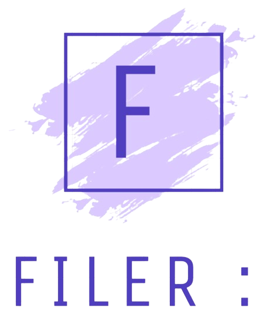
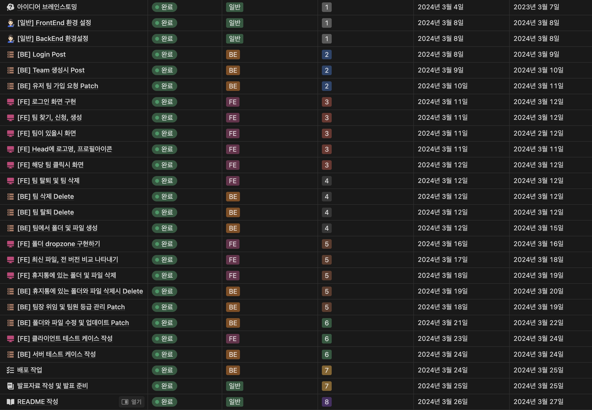
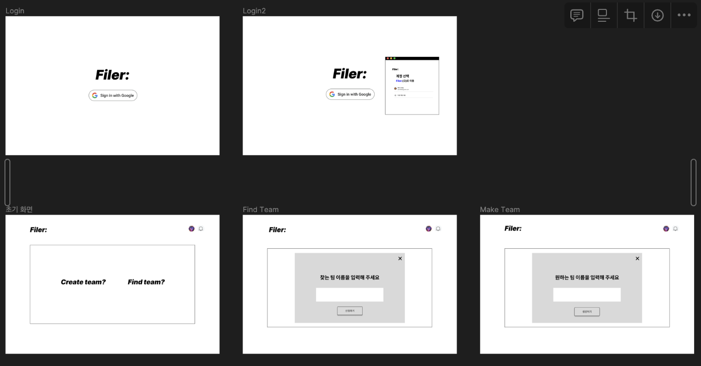
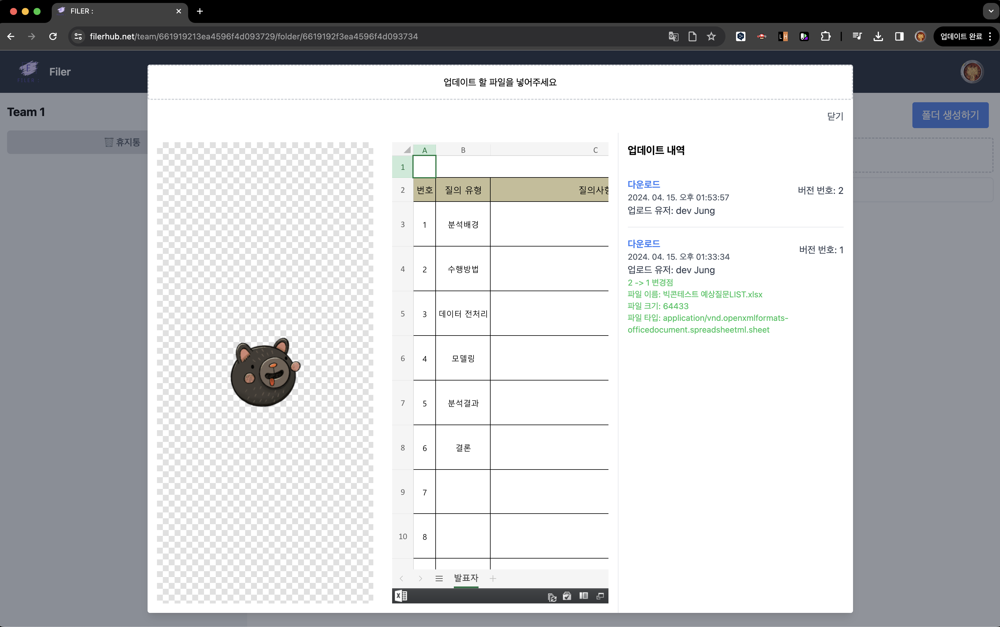
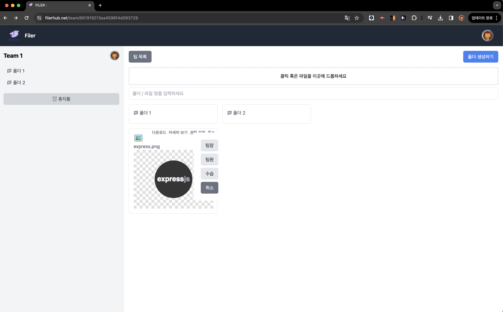
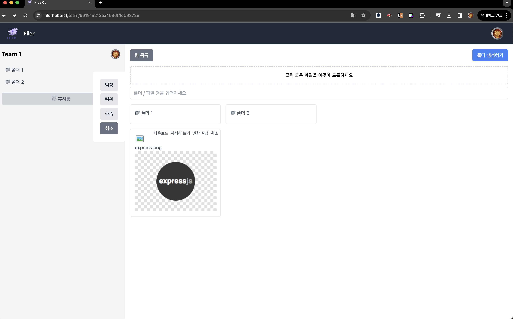
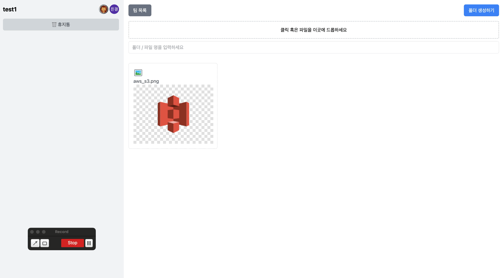

# FILER :

<p align="center">
  
</p>

<p align="center">
  팀 협업을 위한 파일 공유 및 관리 플랫폼으로 파일에 대한 버전 관리를 제공해줍니다.
</p>

<p align="center">
  <a href="https://www.filerhub.net/">FILER Website</a>
  <span> | </span>
  <a href="https://github.com/JungDeunGyul/FILER-front">Frontend Repository</a>
  <span> | </span>
  <a href="https://github.com/JungDeunGyul/FILER-back">Backend Repository</a>
</p>

<br>

# 📖 CONTENTS
- [💪 Project Background & Progress](#-project-background--progress)
  - [1. 프로젝트 배경 및 동기](#1-프로젝트-배경-및-동기)
    - [프로젝트 배경](#프로젝트-배경)
    - [프로젝트 동기](#프로젝트-동기)
  - [2. 프로젝트 소개](#2-프로젝트-소개)
  - [3. 프로젝트 일정](#3-프로젝트-일정)
    - [Kanban Board 통한 프로세스 진행](#kanban-board-통한-프로세스-진행)
    - [피그마를 사용하여 목업 디자인](#피그마를-사용하여-목업-디자인)
    - [Vite vs Webpack](#vite-vs-webpack)
      - [Vite를 사용한 이유](#vite를-사용한-이유)
- [🔍 Preview](#-preview)
- [📚 Tech Stacks](#-tech-stacks)
- [🕹️ Features](#️-features)
- [💡 Why Use React?](#-why-use-react)
  - [1. 컴포넌트 기반 아키텍처](#1-컴포넌트-기반-아키텍처)
  - [2. 가상 DOM과 성능](#2-가상-dom과-성능)
  - [3. 개발 생산성 향상](#3-개발-생산성-향상)
  - [4. 단방향 데이터 흐름](#4-단방향-데이터-흐름)
- [🧑🏻‍🔧 Pain Point](#🧑🏻‍🔧-pain-point)
  - [[문제점 1]: 사용자가 파일 업로드, 다운로드를 시도 할때 생긴 문제](#문제점-1-사용자가-파일-업로드-다운로드를-시도-할때-생긴-문제)
    - [[해결방법 1]: 서버 측에서 adm-zip 라이브러리를 사용](#해결방법-1-서버-측에서-adm-zip-라이브러리를-사용)
      - [adm-zip vs JSZip](#adm-zip-vs-jszip)
        - [adn-zip 장점과 단점](#adm-zip-장점과-단점)
        - [JSZip 장점과 단점](#jszip-장점과-단점)
        - [adm-zip 선택 이유](#adm-zip-선택-이유)
      - [파일을 왜 서버측에서 처리했을까?](#파일을-왜-서버측에서-처리했을까)
        - [클라이언트 측과 서버 측에서 압축해제 할 경우의 차이점](#클라이언트-측과-서버-측에서-압축해제-할-경우의-차이점)
        - [파일을 서버 측에서 압축해제 한 이유](#파일을-서버-측에서-압축해제-한-이유)
      - [adm-zip 라이브러리 사용 결과](#adm-zip-라이브러리-사용-결과)
    - [[해결방법 2]: multer와 multerS3 MIME 유형을 명시적으로 작성](#해결방법-2-multer와-multers3-mime-유형을-명시적으로-작성)
      - [[제약사항]: MIME 유형을 명시적으로 작성 할 경우](#제약사항-mime-유형을-명시적으로-작성-할-경우)
    - [[결론]: `multerS3.AUTO_CONTENT_TYPE` 사용](#결론-multers3auto_content_type-사용)
    - [[회고]: 파일 업로드 및 다운로드 문제 해결을 통한 개발 경험 회고](#회고-파일-업로드-및-다운로드-문제-해결을-통한-개발-경험-회고)
  - [[문제점 2]: 한글 파일 이름이 깨지는 현상](#문제점-2-한글-파일-이름이-깨지는-현상)
    - [[원인]](#원인)
    - [해결방법의 장단점 비교](#해결방법의-장단점-비교)
      - [[해결방법 1]: `encodeURIComponent`, `decodeURIComponent` 사용하기](#해결방법-1-encodeuricomponent-decodeuricomponent-사용하기)
      - [[해결방법 2]: node.js의 `querystring` 사용](#해결방법-2-nodejs의-querystring-사용)
      - [[해결방법 3]: 정규식 사용하여 변환하기](#해결방법-3-정규식-사용하여-변환하기)
    - [Node.js의 querystring, 정규식을 사용하지 않은 이유](#nodejs의-querystring-정규식을-사용하지-않은-이유)
      - [Node.js의 `querystring` 모듈을 사용하지 않은 이유](#nodejs의-querystring-모듈을-사용하지-않은-이유)
      - [정규식을 사용하여 커스텀 인코딩/디코딩을 구현하지 않은 이유](#정규식을-사용하여-커스텀-인코딩디코딩을-구현하지-않은-이유)
    - [`encodeURIComponent`와 `decodeURIComponent`를 사용한 이유](#encodeuricomponent와-decodeuricomponent를-사용한-이유)
    - [[결론]: `encodeURIComponent`와 `decodeURIComponent`를 사용](#결론-encodeuricomponent와-decodeuricomponent를-사용)
    - [[회고]: 사용자가 파일 업로드, 다운로드를 시도 할때 생긴 문제](#문제점-1-사용자가-파일-업로드-다운로드를-시도-할때-생긴-문제)
- [[프로젝트 개선점]](#프로젝트-개선점)
  - [1. 파일 업로드 후 팀원끼리 즉시 확인 가능하게 개선](#1-파일-업로드-후-팀원끼리-즉시-확인-가능하게-개선)
  - [2. Typescript](#2-typescript)
- [🗓 Schedule](#-schedule)
- [📒 프로젝트 소감](#-프로젝트-소감)

<br>

# **💪 Project Background & Progress**

### 1. 프로젝트 배경 및 동기

#### 프로젝트 배경
---

일상적인 작업을 진행하고, 파일을 보관할 때 파일이 쌓이면 쌓일 수록 관리하는 데에 있어 불편함이 생기기 때문에 파일에 대한 버전관리가 필요하다고 생각하였습니다.

#### 파일 관리의 필요성

1. **파일 혼동 방지:**
파일이 많아질수록 비슷한 이름의 파일들이 많아지기 쉽습니다. 이를 방치하면 잘못된 파일을 수정하거나 삭제할 위험이 증가합니다. 버전 관리를 통해 각 파일의 버전을 명확히 구분하고, 필요할 때 정확한 버전을 쉽게 찾을 수 있어 혼동을 방지할 수 있습니다.

2. **변경 이력 추적:**
프로젝트 진행 중 파일이 여러 번 수정되거나 업데이트될 때, 변경된 사항을 추적할 필요가 있습니다. 버전 관리를 통해 파일의 변경 이력을 기록하고, 이전 버전의 변경 사항을 검토할 수 있어 파일 관리가 더욱 체계적이고 투명해집니다.

3. **협업 효율성 증대:**
여러 사람이 함께 작업할 때, 각자의 수정 사항이 충돌하거나 덮어쓰는 문제를 방지하기 위해서는 버전 관리가 필수적입니다. 버전 관리를 통해 각자의 작업이 기록되고 되어, 작업의 일관성을 유지할 수 있습니다.

#### 프로젝트 동기
---

이 프로젝트를 통해 프론트엔드와 백엔드 양측에서의 개발 경험을 쌓을 수 있는 기회를 가지고 최신 웹 기술을 활용하여 사용자에게 보다 직관적이고 실시간으로 반응하는 경험을 제공하는 것을 목표로 했습니다.

이를 위해 React와 Node.js를 활용한 전반적인 애플리케이션 아키텍처 설계부터, 실시간 데이터 업데이트를 위한 Server-Sent Events (SSE), 데이터 관리를 위한 MongoDB를 사용하기로 결정하였습니다.

- **React:**
는 컴포넌트 기반의 구조로 재사용성과 유지보수성을 높이며, 동적인 사용자 인터페이스를 쉽게 구축할 수 있게 해줍니다. 이를 통해 프론트엔드에서의 데이터 변경 사항이 즉각적으로 반영되는 반응형 UI를 구현할 수 있습니다.

- **Node.js:**
는 비동기 이벤트 기반의 서버 환경을 제공하여 높은 성능과 확장성을 보장합니다. 서버 사이드 로직을 효율적으로 처리하고, 클라이언트와의 원활한 데이터 통신을 가능하게 합니다.

- **Server-Sent Events (SSE):**
 클라이언트와 서버 간의 단방향 실시간 통신을 가능하게 하여, 서버에서 클라이언트로 즉각적인 업데이트를 전달할 수 있습니다. 이를 통해 파일 업로드, 삭제, 팀 가입 및 신청, 등의 이벤트를 실시간으로 사용자에게 알릴 수 있습니다.

- **MongoDB:**
는 NoSQL 데이터베이스로, 유연한 스키마를 제공하여 파일 메타데이터 및 사용자 정보를 효율적으로 저장하고 관리할 수 있습니다.

### 2. 프로젝트 소개
---

Filer: 는 팀 협업을 위한 파일 공유 및 관리 플랫폼으로, 팀원들 간에 쉽게 파일을 공유하고 최신 상태를 유지할 수 있는 웹 어플리케이션입니다. 이 플랫폼은 사용자가 업로드한 파일에 대한 버전 관리를 제공하며, 최신 버전과 이전 버전 간의 변경 사항을 보여줍니다.

팀원들은 다양한 파일 형식을 업로드하고 공유함으로써 프로젝트의 효율성을 향상시킬 수 있습니다. 또한, 파일의 수정 내역과 변경 이력을 쉽게 확인하여 작업의 일관성을 유지할 수 있습니다. 최신 버전과 구 버전 간의 차이를 빠르게 파악할 수 있어 효율적인 협업 환경을 제공합니다.

**주요 기능:**

1. **파일 공유 및 업로드:**
    - 사용자는 팀 내에서 파일을 업로드하고 공유할 수 있습니다.
    - 다양한 파일 형식을 지원하여 문서, 이미지, 음악 등을 손쉽게 관리할 수 있습니다.
2. **버전 관리:**
    - 파일의 수정 및 업데이트가 있을 때마다 버전을 관리합니다.
    - 모든 버전은 시간 순서대로 기록되어 변경 이력을 투명하게 확인할 수 있습니다.
3. **파일 비교 및 차이 확인:**
    - 최신 버전과 이전 버전 간의 변경 사항을 시각적으로 비교할 수 있는 기능을 제공합니다.
    - 수정된 부분은 강조하여 사용자가 빠르게 변경 사항을 인식할 수 있습니다.
4. **접근 권한 관리:**
    - 파일과 폴더 및 버전에 대한 접근 권한을 설정 할 수 있습니다.

**부가 기능:**

1. **알림 및 이벤트 알림:**
    - 팀 가입 요청 및 팀 가입 수락 및 거절에 대한 알람을 제공합니다.
2. **휴지통 및 복구:**
    - 사용자가 실수로 파일을 삭제했을 때 손쉽게 회복할 수 있습니다.

### 3. 프로젝트 일정
---

#### 프로젝트 기간: 2024.03.04(월) ~ 2024.03.28(수)

**2024.03.04 - 2024.03.10**

- 프로젝트 아이디어 선정
- POC 진행
- KANBAN 작성
- 기술스택 선정
- 보일러 플레이트 생성
- 로그인, Team 생성 구현

**2024.03.11 - 2024.03.17**

- 유저 팀 가입 요청 구현
- 팀 생성, 신청 구현
- 팀 클릭시 화면 구현
- 팀 탈퇴 및 삭제 구현
- 팀 내에서 폴더 및 파일 생성 구현
- 폴더 DropZone 구현

**2024.03.18 - 2024.03.24**

- 최신 파일, 전 버전 비교 구현
- 휴지통 폴더, 파일 삭제 구현
- 팀장 위임 및 등급 관리 구현
- 폴더, 파일 수정 및 업데이트 구현

**2024.03.25 - 2024.03.28**

- 배포 작업
- README 작성

### Kanban Board 통한 프로세스 진행
---

#### FilerHub Kanban Board
---

<p align="center">
  
</p>

Kanban Board는 프로젝트 관리를 시각화하고 작업 흐름을 효율적으로 관리할 수 있는 도구입니다.

**작업 시각화:**
Kanban Board는 프로젝트의 각 작업 단계를 한눈에 볼 수 있게 합니다. 이는 현재 어떤 작업이 진행 중인지, 어떤 작업이 완료되었는지, 그리고 어떤 작업이 아직 시작되지 않았는지를 명확히 파악할 수 있게 도와줍니다. 이러한 시각화는 혼자서 작업할 때도 매우 유용하며, 프로젝트의 전체적인 진행 상황을 쉽게 추적할 수 있게 합니다.

**우선순위 관리:**
Kanban Board를 사용하면 작업의 우선순위를 명확히 설정할 수 있습니다. 해야 할 일, 진행 중인 일, 완료된 일을 구분하여 관리할 수 있으며, 이를 통해 중요한 작업을 먼저 처리하고 덜 중요한 작업은 나중으로 미루는 등 효율적인 시간 관리를 할 수 있습니다.

**작업 흐름 최적화:**
Kanban Board는 작업의 흐름을 시각적으로 표현하여 병목 현상이나 작업 지연을 쉽게 파악할 수 있게 합니다. 이를 통해 작업 흐름을 최적화하고, 필요한 경우 작업 방식을 조정하여 더 효율적으로 프로젝트를 진행할 수 있습니다.

**성취감 및 동기부여:**
완료된 작업이 Kanban Board의 'Done' 칼럼으로 이동할 때마다 성취감을 느낄 수 있습니다. 이는 혼자서 프로젝트를 진행할 때 지속적인 동기부여가 될 수 있으며, 프로젝트 완료에 대한 긍정적인 피드백을 지속적으로 받을 수 있게 합니다.

**기록 및 회고:**
Kanban Board는 작업의 진행 기록을 체계적으로 남길 수 있게 합니다. 이를 통해 프로젝트 완료 후 회고할 때 유용하게 사용할 수 있으며, 향후 프로젝트를 진행할 때 참고할 만한 자료로 활용할 수 있습니다.

> 이와 같이, Kanban Board를 활용함으로써 체계적이고 효율적인 작업 관리가 가능했습니다. 이를 통해  작업의 투명성과 일관성을 유지할 수 있었습니다.

### Kanban Board vs Waterfall Model
---
Kanban Board 외에도 다양한 애자일(Agile) 프로젝트 관리 방법이 존재합니다. 그 중 대표적인 방법 중 하나는 Waterfall Model입니다. Kanban Board와 Waterfall Model를 비교해보면 다음과 같은 차이점이 있습니다.

**Kanban Board:**

- **유연한 접근:**
Kanban Board는 작업의 흐름을 시각화하고, 필요에 따라 작업을 추가하거나 변경할 수 있습니다. 이는 프로젝트 진행 중 발생하는 변경 사항에 유연하게 대응할 수 있게 합니다.

- **지속적인 개선:**
작업의 흐름을 지속적으로 모니터링하고, 병목 현상을 파악하여 개선할 수 있습니다. 이는 프로젝트의 효율성을 높이고, 빠른 문제 해결을 가능하게 합니다.

- **명확한 작업 상태:**
각 작업의 상태를 시각적으로 한눈에 파악할 수 있어, 프로젝트의 전체적인 진행 상황을 쉽게 확인할 수 있습니다.

**Waterfall Model:**

- **단계적 접근:**
Waterfall Model은 각 단계가 순차적으로 진행되는 방식입니다. 계획 단계, 설계 단계, 구현 단계, 테스트 단계, 배포 단계 등 각 단계가 완료된 후에 다음 단계로 넘어갑니다.

- **고정된 계획:**
초기 단계에서 전체 프로젝트의 계획과 요구사항이 확정되며, 이후 변경이 어렵습니다. 이는 명확한 목표 설정과 계획 수립에는 유리하지만, 유연한 대응이 필요한 상황에서는 비효율적일 수 있습니다.

- **진행 상황 파악의 어려움:**
각 단계가 완료될 때까지는 프로젝트의 전체 진행 상황을 파악하기 어렵습니다. 중간에 문제가 발생해도 다음 단계로 넘어가기 전까지는 확인이 어려울 수 있습니다.

> 이와 같이, 이번 프로젝트에서는 Kanban Board를 활용하여 유연하고 효율적인 프로젝트 관리를 실현할 수 있었습니다. Waterfall Model과 비교했을 때, 혼자서 진행하는 프로젝트에서는 특히 작업의 시각화와 유연한 대응이 중요한데, Kanban Board가 이러한 요구를 충족시켰습니다.

### 피그마를 사용한 목업 디자인
---

#### FilerHub 피그마 목업
---

<div align="center">
  <table>
    <tr>
      <td align="center">
        
        <p>로그인 화면</p>
      </td>
      <td align="center">
        
        <p>로그인 후 화면</p>
      </td>
    </tr>
  </table>
</div>

피그마 플랫폼은 클라우드 기반의 디자인 도구로서 실시간으로 변경 사항을 반영하며 직관적인 인터페이스를 제공합니다.

**아이디어 구체화:** 목업을 만들면서 프로젝트의 기획과 디자인을 더욱 명확하게 정립할 수 있었습니다.

**실시간 수정 및 개선:** 목업을 만들고 실시간으로 수정하며 개선할 수 있습니다. 디자인을 변경하거나 요소를 추가하는 과정에서도 피그마의 유연성을 활용할 수 있었습니다.

**프로토타이핑:** 피그마를 사용하면 빠르게 프로토타입을 제작할 수 있습니다. 개인 프로젝트에서도 프로토타입을 만들어 보면서 사용자 경험을 시뮬레이션하고 개선할 수 있었습니다.

### Vite vs Webpack
---

**번들링 방식:**

- Vite: 개별 파일들을 처리하기 위해 브라우저에서 동작하는 ES 모듈 번들러를 사용합니다. 개발 서버에서는 모듈들을 실시간으로 처리하고, 프로덕션 빌드에서는 더 빠른 Rollup을 사용합니다.

- Webpack: 모든 모듈을 번들링한 후에 브라우저에서 사용할 수 있는 번들 파일을 생성합니다.

**개발 서버의 성능:**

- Vite: 개발 서버가 빠르며, HMR이 빠르게 동작하여 코드 변경을 즉시 반영할 수 있습니다.

- Webpack: 개발 서버가 Vite에 비해 상대적으로 느리고, HMR도 더 많은 시간이 걸릴 수 있습니다.

**기본 설정:**

- Vite: 기본적으로는 React 프로젝트를 위한 프리셋을 제공하며, 즉시 사용할 수 있는 프로젝트 템플릿을 제공합니다.

- Webpack: 초기 설정 및 구성이 필요하며, 다양한 loader와 plugin을 추가해야 합니다.

**플러그인 생태계:**

- Webpack: 다양한 로더와 플러그인을 지원하며, 많은 개발자들이 사용하는 다양한 플러그인이 있습니다.

- Vite: 아직은 Webpack에 비해 플러그인이 적습니다.

**용도:**

- Vite: React 같은 단일 페이지 애플리케이션 프레임워크를 위한 개발 환경을 제공합니다.

- Webpack: 다양한 프로젝트 및 환경에 대해 유연하게 적용할 수 있습니다.

### Vite를 사용한 이유
---

ES 모듈 번들링 방식의 이점: 브라우저에서 동작하는 ES 모듈 번들러를 사용하여 개별 파일을 처리하는데, 이 방식은 개발 서버에서 모듈을 실시간으로 처리하고, 프로덕션 빌드에서는 더 빠른 Rollup을 사용하여 번들링을 수행하여 빌드 시간을 최소화합니다.

개발 속도와 효율성: 개발 서버가 빠르며, HMR이 빠르게 동작하여 코드 변경을 즉시 반영하여, 개발자가 생산성을 높이고 더 빠르게 애플리케이션을 개발할 수 있도록 도와줍니다.

간편한 설정과 초기 구성: React 프로젝트를 위한 기본 프리셋을 제공하며, 미리 구성된 프로젝트 템플릿을 제공하여 초기 설정과 구성을 간소화합니다.

React 프로젝트에 최적화된 환경: React 프로젝트를 위한 프리셋을 기본적으로 제공하여 React 애플리케이션을 개발하는 데 필요한 도구와 구성을 쉽게 이용할 수 있습니다.

> 빠른 개발 속도, 간편한 설정, 효율적인 빌드 방식의 이유로 Vite를 선택하여 사용하였습니다.

<br>

# **🔍 Preview**

<p align="center">
  
</p>

<p align="center">
  사용자가 쉽게 파일을 업로드 및 다운로드 받을 수 있습니다.
</p>

<p align="center">
  
</p>

<p align="center">
  사용자가 해당 파일 클릭시 전 버전과 비교가 가능합니다.
</p>

<p align="center">
  <!--  -->
</p>

<p align="center">
  해당 팀의 팀장은 파일 및 폴더에 접근 권한을 설정할 수 있고, 팀원의 등급을 관리 할 수 있습니다.
</p>

<br>

# **📚 Tech Stacks**

### **Client**


### **Server**


### **Test**


### Deployment


### Refactoring


<br>

# **🕹️ Features**

FILER : 서비스의 주요 기능입니다.

큰 맥락으로는 팀원과 함께 폴더 혹은 파일에 파일을 업로드하여 업로드 한 내역을 볼 수 있고, 권한을 부여하여 특정 인원만 볼 수 있게 구현 하였습니다.

### 1. 파일 자세히 보기

<div align="center">
  
</div>

- 사용자는 기존에 업로드 되어있는 파일에 업로드할 수 있고, 전 파일들을 클릭시 최신 버전과 비교하여 볼 수 있습니다.

  - 최대 파일 사이즈는 30MB이며, 파일 타입은 bmp, csv, odt, doc, docx, gif, htm, html, jpg, jpeg, pdf, png, ppt, pptx, tiff, txt, xls, xlsx, mp4, webp 포맷만 업로드 가능합니다. 이 조건에 부합하지 않는 파일이 업로드 될 경우, 오류 메시지를 보여줍니다.
  - 다운로드를 클릭 시 해당 버전의 파일을 다운로드 할 수 있습니다.

### 2. 파일 및 폴더 권한 설정

<div align="center">
  
  
</div>

- 해당 팀의 팀장은 기존에 업로드 되어있는 파일 및 폴더들을 클릭시 접근권한을 부여 할 수 있습니다.

  - 접근권한이 없는 유저는 해당 폴더나, 파일을 열람 할 수 없고, 접근권한이 없다는 메시지를 보여줍니다.

### 3. Drag & Drop 적용

<div align="center">
  
</div>

- 사용자가 이용하기 쉽게 Drag & Drop을 적용하였습니다.
  - 폴더 및 휴지통에 파일을 옮길 수 있게 구현하였습니다.

<br>

# **💡 Why Use React?**

React를 선택한 이유는 다음과 같습니다:

### 1) 컴포넌트 기반 아키텍처

React는 컴포넌트 기반 아키텍처를 사용하여 UI를 작은 단위의 독립적인 컴포넌트로 분할합니다. 이러한 구조는 코드의 재사용성을 높이고 유지보수를 용이하게 만듭니다. 이 프로젝트에서도 파일 업로드 버튼, 폴더 목록, 파일 비교 등과 같은 UI 요소들을 각각의 컴포넌트로 나누어 개발하였습니다. 이를 조합하여 복잡한 사용자 인터페이스를 구축할 수 있었습니다.

컴포넌트 기반 아키텍처를 통해 복잡한 UI 관리가 용이해졌습니다. 각 컴포넌트는 자체적으로 상태와 라이프사이클 메서드를 가지고 있기 때문에, UI 요소의 동작을 세밀하게 제어할 수 있었습니다. 또한, 컴포넌트 간의 의존성을 최소화하여 코드의 유지보수성을 향상시켰습니다.

### 2) 가상 DOM과 성능

React의 가상 DOM은 실제 DOM 조작을 최소화하여 성능을 향상시킵니다. 가상 DOM은 메모리에 존재하는 가상의 DOM 트리로, 변경된 부분만을 감지하여 실제 DOM과 동기화합니다. 이로써 실제 DOM 조작을 최소화하고 빠른 렌더링을 실현할 수 있었습니다. 특히 이 프로젝트에서는 파일 업로드나 버전 비교와 같은 작업이 빈번하게 발생하므로, React의 가상 DOM을 활용하여 성능을 최적화하였습니다.

가상 DOM을 사용하는 React는 변경된 부분만을 업데이트하여 실제 DOM 조작을 최소화함으로써 빠른 응답성을 제공합니다. 사용자가 파일을 업로드하거나 버전을 비교할 때의 빠른 응답성은 사용자들이 애플리케이션을 더욱 편리하게 사용할 수 있도록 도와줍니다.

### 3) 개발 생산성 향상

React의 JSX 문법은 UI 개발을 보다 직관적이고 효율적으로 만들어주었습니다. JSX를 사용하면 UI를 렌더링하는 동안 데이터와 UI 요소를 간편하게 조작할 수 있습니다.

### 4) 단방향 데이터 흐름

React는 단방향 데이터 흐름을 따르는데, 이는 데이터의 흐름이 단순하고 예측 가능하다는 것을 의미합니다. 이로써 데이터의 상태 변화를 추적하고 이해하기 쉬워지며, 버그를 예방하고 디버깅을 용이하게 만듭니다.

이러한 장점들은 프로젝트의 개발 과정을 효율화하고 사용자에게 뛰어난 경험을 제공하는 데 도움이 된다고 생각하였습니다. 특히 React의 컴포넌트 기반 아키텍처는 UI를 재사용 가능한 단위로 분할하여 개발할 수 있도록 도와주었습니다. 이는 개발 시간을 단축하고 코드의 가독성과 유지 보수성을 향상시켰습니다.

또한, React의 가상 DOM을 이용하여 성능을 최적화함으로써 사용자가 애플리케이션을 빠르게 이용할 수 있도록 도왔습니다. 빠른 응답성은 사용자가 작업을 편리하게 수행할 수 있게 해주며, 이는 사용자 만족도를 높이는 데 기여했습니다.

이렇게 4가지의 이유로 React를 선택하게 되었습니다.

<br>

# **🧑🏻‍🔧 Pain Point**

## [문제점 1]: 사용자가 파일 업로드 및 다운로드를 시도 할때 생긴 문제

클라이언트에서 파일 업로드 시 AWS S3에서 .ppt, .pptx, .xls, .xlsx 등의 파일들이 .zip파일로 저장되어 화면 렌더링 시 문제가 발생하였고, 사용자가 해당 파일을 다운로드 받을 때 손상된 파일이 다운 받아졌습니다.

이 문제를 해결하기 위해 2가지 방법을 적용해보았습니다.

## 1. 1 서버 측에서 adm-zip 라이브러리를 사용

### 서버측에서 압축 해제한 이유

서버 측에서 파일을 압축 해제하거나 클라이언트 측에서 파일을 압축 해제하는 두 가지 방법에는 차이점이 있습니다.

- 클라이언트의 컴퓨터 사양은 다양하며, 따라서 클라이언트 측에서 대용량 파일을 처리하는 것은 사용자의 디바이스에 따라 다른 문제를 일으킬 수 있습니다. 사용자의 디바이스가 처리 속도나 저장 용량이 부족할 경우 파일 처리 작업이 느려지거나 실패할 수 있습니다. 예를 들어, 일부 사용자의 컴퓨터는 처리 속도가 느리거나 저장 용량이 제한적일 수 있으며, 대용량 파일을 처리하는 동안 성능 저하가 발생할 수 있습니다.

- 서버 측에서 대용량 파일을 처리하고 클라이언트에게 처리된 파일을 전달하는 것이 더 안전하고 효율적인 접근 방식입니다. 서버 측에서는 빠른 네트워크 연결과 강력한 하드웨어 리소스를 활용하여 대용량 파일을 효율적으로 처리할 수 있습니다. 또한, 서버 측에서 처리하는 경우 클라이언트의 디바이스 사양에 관계없이 일관된 성능과 안정성을 제공할 수 있습니다.

### adm-zip 라이브러리 사용 결과

서버 측에서 파일을 압축 해제 한 결과 파일이 손상되었다는 문제를 발견하였습니다. 처음부터 클라이언트에서 업로드한 파일이 오인식되어 zip 파일로 저장되는 과정에서 이미 파일이 손상되었던 것이였습니다. 그렇기 때문에 adm-zip을 사용하여 파일을 압축 해제를 하여도 이미 손상된 파일이기 때문에 이 문제를 adm-zip 라이브러리를 사용하여 해결할 수 없었습니다.

### 1. 2 multer와 multerS3 MIME 유형을 명시적으로 작성

명시적으로 MIME 유형을 작성했을 때 의도치 않게 zip 형식으로 저장되는 문제는 해결되었지만, 확장성과 유지 보수성 면에서는 좋은 방식이라고 생각되지 않았습니다.
```jsx
const s3Uploader = multer({
  storage: multerS3({
    s3: s3,
    bucket: "your-bucket-name",
    contentType: function(req, file, cb) {
      switch (file.mimetype) {
        case "application/vnd.ms-powerpoint":
          cb(null, "application/vnd.ms-powerpoint");
          break;
        case "application/vnd.openxmlformats-officedocument.presentationml.presentation":
          cb(null, "application/vnd.openxmlformats-officedocument.presentationml.presentation");
          break;
        case "application/vnd.ms-excel":
          cb(null, "application/vnd.ms-excel");
          break;
        case "application/vnd.openxmlformats-officedocument.spreadsheetml.sheet":
          cb(null, "application/vnd.openxmlformats-officedocument.spreadsheetml.sheet");
          break;
        default:
          cb(new Error("Invalid file type."));
      }
    },
    key: function (req, file, cb) {
      cb(null, Date.now().toString());
    }
  })
});
```

명시적으로 MIME 유형을 작성하여 문제를 해결했지만, 이 방법은 확장성과 유지 보수성 측면에서 일부 제약이 있을 수 있습니다.

### 제약사항
---
- 변경 사항 적용 시간: 새로운 파일 형식이 추가되거나 삭제될 때마다 코드를 직접 수정해야 하므로 변경 사항을 적용하는 데 시간이 걸릴 수 있습니다. 이는 기존 코드의 수정과 테스트를 필요로 하므로 개발 및 배포 프로세스에 추가적인 시간이 필요합니다.

- 실수 가능성: 변경 작업 중에 실수할 가능성이 있습니다. 파일 형식이나 MIME 유형을 명시적으로 작성할 때, 각 형식에 대한 정확한 MIME 유형을 인식하고 지정해야 합니다. 이는 실수할 가능성이 있는 작업이므로 실수를 방지하기 위해 주의가 필요합니다. 예를 들어, 잘못된 MIME 유형을 설정하거나, 새로운 형식을 누락할 수 있습니다. 이러한 실수는 애플리케이션의 정상 작동에 영향을 줄 수 있습니다.

### [결론] : multerS3.AUTO_CONTENT_TYPE 사용
---
이러한 제약을 해결하기 위해 동적인 방식으로 MIME 유형을 처리할 수 있는 더 유연한 방법을 고려 하였습니다. `multerS3.AUTO_CONTENT_TYPE`을 사용하여 자동으로 MIME 유형을 설정하였습니다.

또한, Multer-S3 라이브러리의 특성상 파일의 확장자를 정확히 감지하지 못할 수 있기 때문에, 확장자를 명시적으로 설정하고 MIME 유형을 정확하게 지정하기 위해 key 함수에 파일의 이름과 확장자를 명시적으로 작성했습니다. 이를 통해 AWS S3에서 파일을 오인식하여 .zip 형식으로 저장되는 문제를 해결할 수 있었습니다.

### [회고]: 파일 업로드 및 다운로드 문제 해결을 통한 개발 경험 회고
---

문제 해결 과정을 통해 알 수 있듯이, 개발 과정에서 문제가 발생했을 때 해결책을 찾기 위해 여러 가지 시도를 해보는 것이 중요하다고 생각하게 되었습니다. 이런 과정에서 문제의 원인을 정확하게 파악하고, 각 해결책의 장단점을 고려하여 적절한 방법을 선택하는 것이 필요합니다.

- 첫 번째 시도에서는 서버 측에서 파일을 압축 해제하기 위해 adm-zip 라이브러리를 사용했습니다. 하지만 이 방법은 파일이 이미 손상된 상태로 저장되었기 때문에 문제를 해결할 수 없었습니다. 이러한 실패를 통해 클라이언트 측에서 파일을 업로드할 때 파일의 확장자를 명시적으로 설정하는 것이 중요함을 깨달았습니다.

- 두 번째 시도에서는 multerS3 라이브러리를 사용하여 파일의 MIME 유형을 명시적으로 작성하는 방법을 시도했습니다. 하지만 이 방법은 확장성과 유지 보수성 측면에서 제약이 있었습니다. 변경 사항을 적용하는 데 시간이 걸리고, 실수할 가능성이 있기 때문에 이 방법을 선택하는 것은 적합하지 않았습니다.

- 마지막으로, 동적인 방식으로 MIME 유형을 설정할 수 있는 multerS3.AUTO_CONTENT_TYPE 옵션을 사용하여 문제를 해결했습니다. 이를 통해 파일의 확장자를 명시적으로 설정하고 MIME 유형을 정확하게 지정할 수 있었습니다. 이러한 방법을 통해 AWS S3에서 파일이 오인식되어 손상되는 문제를 해결할 수 있었습니다.

> 문제가 발생했을 때 빠르게 대응하고, 여러 가지 해결책을 시도해보며 문제의 원인을 파악하는 것이 중요하다는 것을 알게 되었습니다. 또한, 각 해결책의 장단점을 고려하여 최적의 방법을 선택하는 것이 필요하다는 것을 배웠습니다.

## [문제점 2]: 파일 이름이 깨지는 현상

<p align="center">
  
</p>

파일 이름이 서버로 전송될 때 깨지는 문제는 파일 이름에 특수 문자나 비 ASCII 문자가 포함된 경우 발생할 수 있습니다. 이 문제는 다음과 같은 이유로 발생할 수 있습니다:

### [원인]
---

1. 문자 인코딩 불일치: 웹 브라우저와 서버가 서로 다른 문자 인코딩을 사용하여 파일 이름을 처리할 때 문제가 발생할 수 있습니다. 브라우저는 UTF-8을 사용하여 파일 이름을 인코딩하지만, 서버가 이를 올바르게 처리하지 못하면 파일 이름이 깨져서 나타날 수 있습니다.

2. 특수 문자와 비 ASCII 문자: 파일 이름에 특수 문자(예: 공백, &, #, %, 등)나 비 ASCII 문자(예: 한글, 중국어, 일본어 등)가 포함된 경우, 이를 제대로 처리하지 않으면 파일 이름이 깨져서 나타날 수 있습니다.

***해결방법의 장단점 비교***
---
이 문제를 해결하기 위해 다음과 같은 방법을 고려하였습니다:

1. `encodeURIComponent`, `decodeURIComponent` 사용

- 장점: JavaScript의 내장 함수로 간편하게 사용할 수 있습니다. 클라이언트 측에서 파일 이름을 안전하게 URL에 인코딩할 수 있습니다.

- 단점: 서버 측에서 디코딩할 때 추가적인 작업이 필요합니다. 파일 이름에 특수 문자가 포함되어 있는 경우, URL 인코딩된 문자열이 길어질 수 있습니다.

2. node.js의 `querystring` 사용

- 장점: 서버 측에서 URL 디코딩이 필요한 경우에 유용합니다. 정교한 문자열 처리가 가능하여 특정한 규칙에 따라 변환할 수 있습니다.

- 단점: 사용자가 직접 구현해야 하므로 추가적인 개발 작업이 필요합니다. 복잡한 정규식을 사용할 경우, 성능에 영향을 미칠 수 있습니다.

3. 정규식 사용하여 변환

- 장점: 커스텀한 문자열 변환이 가능하며, 특정 요구사항에 맞춘 인코딩/디코딩 로직을 구현할 수 있습니다.

- 단점: 정규식을 작성하고 유지보수하는 것이 복잡할 수 있으며, 잘못 작성된 정규식은 버그를 유발할 수 있습니다.

### [해결방법 1]: `encodeURIComponent`, `decodeURIComponent` 사용하기
---
encodeURIComponent와 decodeURIComponent를 사용하여 파일 이름을 처리하는 방법은 클라이언트 측에서 파일 이름을 안전하게 URL 인코딩하여 전송하고, 서버 측에서 이를 디코딩하여 사용하는 방식입니다. 이를 통해 특수 문자나 비 ASCII 문자가 포함된 파일 이름도 정상적으로 처리할 수 있습니다. 아래는 multer와 multer-s3를 사용하여 파일 업로드를 처리하는 예시입니다.
```jsx
const s3Uploader = multer({
  storage: multerS3({
    s3: s3client,
    bucket: process.env.AWS_BUCKET,
    contentType: multerS3.AUTO_CONTENT_TYPE,
    key: function (req, file, cb) {
      // 클라이언트 측에서 인코딩된 파일 이름을 디코딩하여 원래 파일 이름 복원
      const originalFilename = decodeURIComponent(file.originalname);

      // 파일 이름에 타임스탬프를 추가하여 고유하게 생성
      cb(null, Date.now().toString() + originalFilename);
    },
  }),
});

module.exports = s3Uploader;
```
이 코드는 클라이언트 측에서 파일 이름을 encodeURIComponent로 인코딩한 후 서버로 전송하고, 서버 측에서 이를 decodeURIComponent로 디코딩하여 파일 이름을 원래대로 복원하는 방식입니다.

### [해결방법 2]: node.js의 `querystring` 사용
---
`querystring` 모듈을 사용하여 파일 이름을 인코딩/디코딩하는 방법도 유사하게 적용할 수 있습니다. `querystring.escape`와 `querystring.unescape`를 사용하여 파일 이름을 처리합니다.
```jsx
const s3Uploader = multer({
  storage: multerS3({
    s3: s3client,
    bucket: process.env.AWS_BUCKET,
    contentType: multerS3.AUTO_CONTENT_TYPE,
    key: function (req, file, cb) {
      // 클라이언트 측에서 querystring.escape로 인코딩된 파일 이름을 디코딩
      const originalFilename = querystring.unescape(file.originalname);

      // 파일 이름에 타임스탬프를 추가하여 고유하게 생성
      cb(null, Date.now().toString() + originalFilename);
    },
  }),
});

module.exports = s3Uploader;
```
이 코드에서는 클라이언트 측에서 파일 이름을 `querystring.escape`로 인코딩한 후 서버로 전송하고, 서버 측에서 이를 `querystring.unescape`로 디코딩하여 파일 이름을 원래대로 복원합니다.

### [해결방법 3]: 정규식 사용하여 변환하기
---
정규식을 사용하여 파일 이름을 커스텀하게 인코딩/디코딩하는 방법은 특정 요구사항에 맞춰 파일 이름을 변환할 수 있습니다.
```jsx
// 커스텀 인코딩 함수
function customEncode(fileName) {
  return fileName.replace(/[^A-Za-z0-9]/g, function(c) {
    return '%' + c.charCodeAt(0).toString(16);
  });
}

// 커스텀 디코딩 함수
function customDecode(encodedFileName) {
  return encodedFileName.replace(/%[0-9A-Fa-f]{2}/g, function(match) {
    return String.fromCharCode(parseInt(match.slice(1), 16));
  });
}

const s3Uploader = multer({
  storage: multerS3({
    s3: s3client,
    bucket: process.env.AWS_BUCKET,
    contentType: multerS3.AUTO_CONTENT_TYPE,
    key: function (req, file, cb) {
      // 클라이언트 측에서 커스텀 인코딩된 파일 이름을 디코딩
      const originalFilename = customDecode(file.originalname);

      // 파일 이름에 타임스탬프를 추가하여 고유하게 생성
      cb(null, Date.now().toString() + originalFilename);
    },
  }),
});

module.exports = s3Uploader;
```
이 코드에서는 클라이언트 측에서 파일 이름을 customEncode 함수로 인코딩한 후 서버로 전송하고, 서버 측에서 이를 customDecode 함수로 디코딩하여 파일 이름을 원래대로 복원합니다. 이를 통해 특수한 요구사항에 맞춘 파일 이름 변환을 처리할 수 있습니다.

***Node.js의 `querystring`, 정규식을 사용하지 않은 이유***
---

### Node.js의 `querystring` 모듈을 사용하지 않은 이유
---

- 일관성 부족: 클라이언트 측에서 Node.js의 `querystring` 모듈을 사용할 수 없기 때문에, 클라이언트와 서버 측에서 서로 다른 인코딩/디코딩 방식을 사용하게 됩니다. 이는 코드의 일관성을 해치며, 유지보수를 어렵게 만들 수 있습니다.
- 중복된 논리: 클라이언트 측에서는 `encodeURIComponent`를 사용하고, 서버 측에서만 `querystring.escape`와 `querystring.unescape`를 사용하는 것은 중복된 논리를 도입하게 되어 코드의 명확성을 떨어뜨립니다.

### 정규식을 사용하여 커스텀 인코딩/디코딩을 구현하지 않은 이유
---

- 복잡성과 유지보수: 정규식을 사용한 인코딩/디코딩 로직은 복잡해질 수 있으며, 이를 유지보수하는 데 상당한 노력이 필요합니다. 특히, 정규식이 잘못 작성된 경우 예기치 않은 버그가 발생할 수 있습니다.
- 예외 처리의 어려움: 정규식을 사용하면 특정한 문자나 패턴을 제대로 처리하지 못할 가능성이 있습니다. 이는 파일 이름에 포함된 예외적인 문자를 올바르게 처리하지 못해, 의도치 않은 오류를 발생시킬 수 있습니다.

### `encodeURIComponent`와 `decodeURIComponent`를 사용한 이유
---
이번 파일 업로드 구현에서는 클라이언트 측과 서버 측 모두에서 일관되게 `encodeURIComponent`와 `decodeURIComponent`를 사용하기로 결정했습니다.

1. 일관성 유지:

- 클라이언트 측과 서버 측에서 동일한 인코딩 및 디코딩 방식을 사용함으로써 코드의 일관성을 유지할 수 있습니다. 이는 디버깅과 유지보수를 용이하게 합니다. 클라이언트 측에서 파일 이름을 `encodeURIComponent`로 인코딩하고, 서버 측에서 이를 `decodeURIComponent`로 디코딩하면, 코드 흐름이 명확해지고, 양쪽 코드가 잘 맞물려 동작하게 됩니다.

2. 표준화된 함수 사용:

- `encodeURIComponent`와 `decodeURIComponent`는 JavaScript의 표준 내장 함수로, 브라우저와 Node.js 환경 모두에서 사용할 수 있습니다. 이는 브라우저 호환성과 서버 측 통합을 단순화하며, 추가적인 라이브러리 의존성을 피할 수 있습니다.

3. 간편성과 신뢰성:

- `encodeURIComponent`와 `decodeURIComponent`는 특수 문자와 비 ASCII 문자를 안전하게 처리할 수 있도록 설계되었습니다. 이를 통해 파일 이름이 URL로 전송될 때 발생할 수 있는 문제를 신뢰성 있게 해결할 수 있습니다.

### [결론]: `encodeURIComponent`와 `decodeURIComponent`를 사용
---
따라서, 이러한 이유들로 인해 클라이언트와 서버 측 모두에서 일관되게 `encodeURIComponent`와 `decodeURIComponent`를 사용하는 것이 최적의 선택이라고 판단하였습니다. 이 방법은 간편하고 신뢰할 수 있으며, 코드의 일관성을 유지할 수 있어 장기적인 유지보수에도 유리하다고 판단하여 사용하게 되었습니다.

### [회고]: 파일 이름 깨짐 문제 해결에 대한 회고
---

프로젝트를 진행하면서 예기치 않은 파일 이름 깨짐 문제가 발생했을 때, 처음에는 당황스러웠습니다. 하지만 이러한 문제를 해결하면서 하나씩 원인을 파악하고 문제를 해결해 나가는 과정에서 많은 것을 배우게 되었습니다.

먼저, 다양한 원인을 고려해보며 문제의 본질을 파악하는 것이 중요하다는 것을 알게 되었습니다. 파일 이름 깨짐 문제는 다양한 요인에 의해 발생할 수 있었는데, 문자 인코딩의 불일치와 특수 문자, 비 ASCII 문자의 처리 부재가 주요 원인으로 드러났습니다.

해결책을 찾기 위해 여러 가지 방법을 검토하고 비교해보는 과정에서, encodeURIComponent와 decodeURIComponent를 사용하는 것이 가장 일관되고 간편한 해결책임을 깨달았습니다. 이 방법은 클라이언트와 서버 간 일관성을 유지하면서 파일 이름을 안전하게 처리할 수 있었습니다.

이번 경험을 통해 논리적 사고의 중요성과 문제 해결 과정에서의 단계별 접근 방법을 깨달았습니다. 또한, 기술적인 문제에 직면했을 때 당황하지 않고 문제를 해결해 나가는 능력을 기를 수 있었다고 생각합니다.

<br>

## [프로젝트 개선점]

### 1. 파일 업로드 후 팀원끼리 즉시 확인 가능하게 개선
---

현재 파일 업로드 후 팀원이 업로드된 파일을 즉시 확인할 수 없고, 페이지를 다시 새로고침해야 하는 불편함이 있습니다. 이는 사용자 경험을 저하시키고 팀의 작업 효율성을 떨어뜨릴 수 있습니다. 이를 개선하기 위해 실시간 알림 시스템을 도입할 수 있습니다. 이 시스템은 파일이 업로드되면 서버에서 클라이언트로 실시간으로 알림을 보내어 팀원들이 바로 해당 파일을 확인할 수 있도록 합니다. 이렇게 함으로써 팀원들은 새로 고침을 하지 않고도 업로드된 파일을 즉시 볼 수 있습니다.

### 2. Typescript
---
TypeScript의 정적 타입 기반, 즉 컴파일을 하는 과정에서 타입을 결정하게 됩니다. 변수에 들어갈 값의 형태에 따라 자료형을 지정해 주어야 하는데, 컴파일 시 자료형에 맞지 않은 값이 들어가면 컴파일 에러를 발생시킵니다. 그러나 TypeScript는 컴파일 과정에서 타입을 지정하기 때문에 컴파일 에러를 예방할 수 있을뿐 아니라, 손쉬운 디버깅이 가능해집니다.

- 정적 타입 검사: Typescript는 정적 타입을 지원하여 코드를 작성할 때 변수의 타입을 명시적으로 지정할 수 있습니다. 이는 코드의 가독성을 향상시키고 디버깅을 용이하게 만들어줍니다. 또한 컴파일 시에 타입 관련 오류를 사전에 발견하여 더 안정적인 개발을 할 수 있습니다.
- 코드 유지 보수성 강화: Typescript는 코드의 가독성을 높이고 잠재적인 버그를 사전에 방지하여 코드의 유지 보수성을 향상시킵니다. 특히 대규모 프로젝트에서는 이러한 장점이 더욱 부각됩니다.

> 위의 개선 방안을 통해 파일 업로드 후 팀원들이 실시간으로 파일을 확인할 수 있게 될것이며, Typescript를 도입함으로써 코드의 가독성과 유지 보수성을 향상시킬 것 입니다. 이러한 변경 사항은 사용자 경험을 향상시키고자 작업의 효율성을 높이는 데 기여할 것이라고 생각합니다.

<br>

# **📆 Schedule**

## 프로젝트 기간: 2024.03.04(월) ~ 2024.03.28(수)

**2024.03.04 - 2024.03.10**

- 프레젝트 아이디어 선정
- POC 진행
- KANBAN 작성
- 기술스택 선정
- 보일러 플레이트 생성
- 로그인, Team 생성 구현

**2024.03.11 - 2024.03.17**

- 유저 팀 가입 요청 구현
- 팀 생성, 신청 구현
- 팀 클릭시 화면 구현
- 팀 탈퇴 및 삭제 구현
- 팀 내에서 폴더 및 파일 생성 구현
- 폴더 DropZone 구현

**2024.03.18 - 2024.03.24**

- 최신 파일, 전 버전 비교 구현
- 휴지통 폴더, 파일 삭제 구현
- 팀장 위임 및 등급 관리 구현
- 폴더, 파일 수정 및 업데이트 구현

**2024.03.25 - 2024.03.28**

- 프로젝트 배포

<br>

# **📒 프로젝트 소감**

팀 프로젝트 이후 개인 프로젝트로 파일 버전 관리라는 아이디어를 내고 이를 프로젝트로 시작하였을 때 부트캠프를 시작하면서 배워왔던 그리고 팀 프로젝트에서 다시 한번 복습하였던 프런트 그리고 백엔드를 활용할 생각에 설렘 반 기대 반이었습니다.

개인 프로젝트를 진행하면서 내가 아는 개념이라고 생각했는데 몰랐던 것과 헷갈리고 있던 개념들을 다시 다듬을 수 있던 시간이었고, 문제점이 발생했을 때 당황하지 않고 문제점을 찾아내, 그 문제를 고민하는 과정을 겪으면서 성장하는 기분을 느끼게 되었습니다.

아직 리팩토링이나 파일 타입 추가, 댓글 기능 추가 등의 추가적으로 보완할 점들이 많지만, 스스로 기능 구현을 하고 문제를 해결할 수 있다는 자신감을 얻게 된 프로젝트였습니다.
