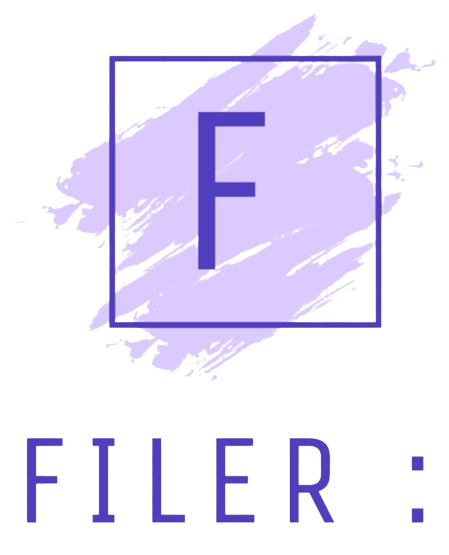
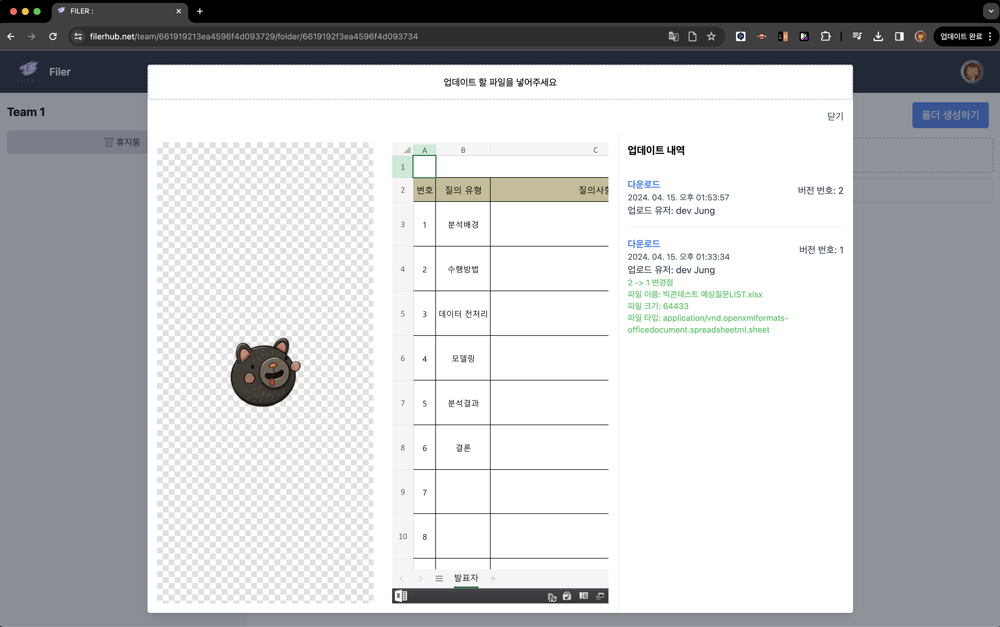
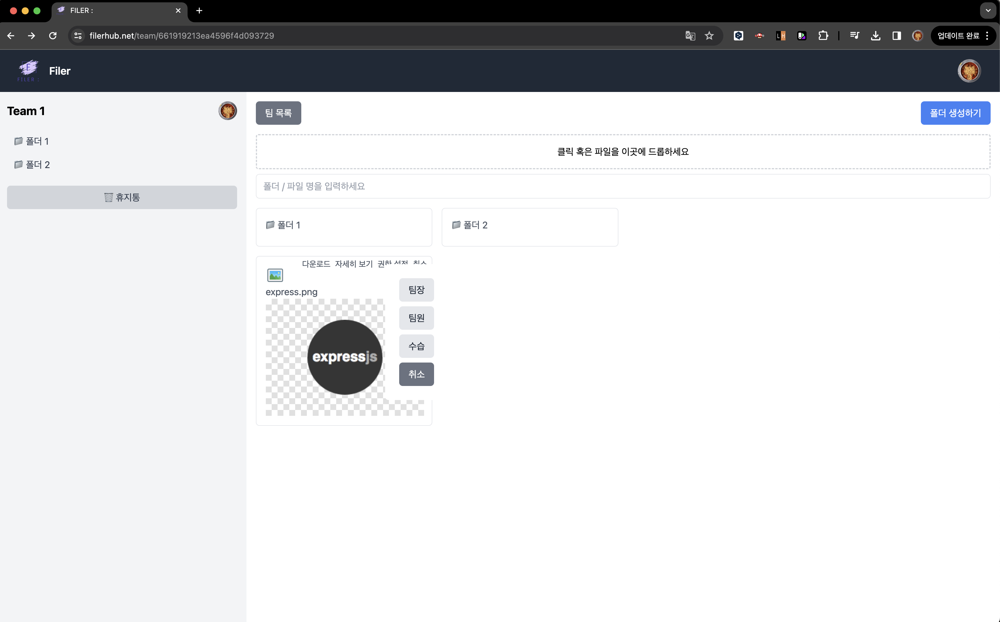
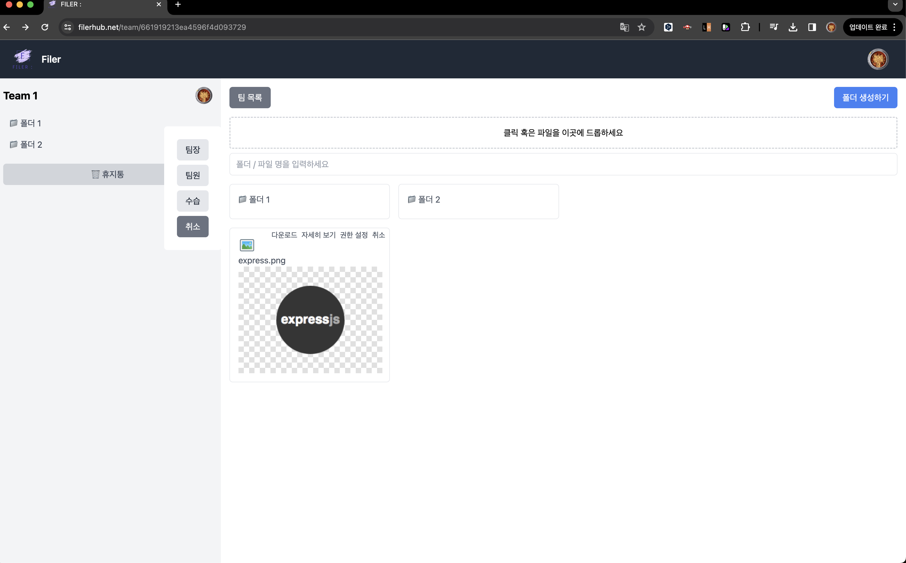

# FILER :

<p align="center">
  
</p>

<p align="center">
  팀 협업을 위한 파일 공유 및 관리 플랫폼으로 파일에 대한 버전 관리를 제공해줍니다.
</p>

<p align="center">
  <a href="https://www.filerhub.net/">FILER Website</a>
  <span> | </span>
  <a href="https://github.com/JungDeunGyul/FILER-front">Frontend Repository</a>
  <span> | </span>
  <a href="https://github.com/JungDeunGyul/FILER-back">Backend Repository</a>
</p>

<br>

# 📖 CONTENTS

- [🔍 Preview](#preview)
- [📚 Tech Stacks](#tech-stacks)
- [💪 Motivation](#motivation)
- [🕹️ Features](#features)
- [💡 Why Use React?](#💡-why-use-react)
  - [1. 컴포넌트 기반 아키텍처](#1-컴포넌트-기반-아키텍처)
  - [2. 가상 DOM과 성능](#2-가상-dom과-성능)
  - [3. 개발 생산성 향상](#3-개발-생산성-향상)
  - [4. 단방향 데이터 흐름](#4-단방향-데이터-흐름)
- [🧑🏻‍🔧 Pain Point](#🧑🏻‍🔧-pain-point)
  - [1. 파일이 의도치 않게 zip 형식으로 AWS S3에 저장되어서 생기는 문제](#1-파일이-의도치-않게-zip-형식으로-aws-s3에-저장되어서-생기는-문제)
    - [1. 1 서버 측에서 adm-zip 라이브러리를 사용](#1-1-서버-측에서-adm-zip-라이브러리를-사용)
      - [서버측에서 압축 해제한 이유](#서버측에서-압축-해제한-이유)
      - [adm-zip 라이브러리 사용 결과](#adm-zip-라이브러리-사용-결과)
    - [1. 2 multer와 multerS3 MIME 유형을 명시적으로 작성](#1-2-multer와-multers3-mime-유형을-명시적으로-작성)
  - [2. 한글 파일 이름이 깨지는 현상](#2-한글-파일-이름이-깨지는-현상)
- [🗓 Schedule](#-schedule)
- [📒 프로젝트 소감](#-프로젝트-소감)

<br>

# **🔍 Preview**

<p align="center">
  
</p>

<p align="center">
  사용자가 쉽게 파일을 업로드 및 다운로드 받을 수 있습니다.
</p>

<p align="center">
  
</p>

<p align="center">
  사용자가 해당 파일 클릭시 전 버전과 비교가 가능합니다.
</p>

<br>

# **📚 Tech Stacks**

### **Client**


### **Server**


### **Test**


### Deployment


### Refactoring


<br>

# **💪 Motivation**

일상적인 작업을 진행하고, 파일을 보관할 때 파일이 쌓이면 쌓일 수록 관리하는 데에 있어 불편함이 생기기 때문에 파일에 대한 버전관리가 필요하다고 생각하였습니다.

FILER는 팀 협업을 위한 효율적인 파일 관리 솔루션을 제공하여 작업을 보다 효율적으로 수행할 수 있도록 지원하였습니다.

<br>

# **🕹️ Features**

FILER : 서비스의 주요 기능입니다.

큰 맥락으로는 팀원과 함께 폴더 혹은 파일에 파일을 업로드하여 업로드 한 내역을 볼 수 있고, 권한을 부여하여 특정 인원만 볼 수 있게 구현 하였습니다.

### 1. 파일 자세히 보기

<div align="center">
  
</div>

- 사용자는 기존에 업로드 되어있는 파일에 업로드할 수 있고, 전 파일들을 클릭시 최신 버전과 비교하여 볼 수 있습니다.

  - 최대 파일 사이즈는 30MB이며, 파일 타입은 bmp, csv, odt, doc, docx, gif, htm, html, jpg, jpeg, pdf, png, ppt, pptx, tiff, txt, xls, xlsx, mp4, webp 포맷만 업로드 가능합니다. 이 조건에 부합하지 않는 파일이 업로드 될 경우, 오류 메시지를 보여줍니다.
  - 다운로드를 클릭 시 해당 버전의 파일을 다운로드 할 수 있습니다.

### 2. 파일 및 폴더 권한 설정

<div align="center">
  
  
</div>

- 해당 팀의 팀장은 기존에 업로드 되어있는 파일 및 폴더들을 클릭시 접근권한을 부여 할 수 있습니다.

  - 접근권한이 없는 유저는 해당 폴더나, 파일을 열람 할 수 없고, 접근권한이 없다는 메시지를 보여줍니다.

### 3. Drag & Drop 적용

<div align="center">
  
</div>

- 사용자가 이용하기 쉽게 Drag & Drop을 적용하였습니다.

<br>

# **💡 Why Use React?**

React를 선택한 이유는 다음과 같습니다:

### 1) 컴포넌트 기반 아키텍처

React는 컴포넌트 기반 아키텍처를 사용하여 UI를 작은 단위의 독립적인 컴포넌트로 분할합니다. 이러한 구조는 코드의 재사용성을 높이고 유지보수를 용이하게 만듭니다. 이 프로젝트에서도 파일 업로드 버튼, 폴더 목록, 파일 비교 등과 같은 UI 요소들을 각각의 컴포넌트로 나누어 개발하였습니다. 이를 조합하여 복잡한 사용자 인터페이스를 구축할 수 있었습니다.

컴포넌트 기반 아키텍처를 통해 복잡한 UI 관리가 용이해졌습니다. 각 컴포넌트는 자체적으로 상태와 라이프사이클 메서드를 가지고 있기 때문에, UI 요소의 동작을 세밀하게 제어할 수 있었습니다. 또한, 컴포넌트 간의 의존성을 최소화하여 코드의 유지보수성을 향상시켰습니다.

### 2) 가상 DOM과 성능

React의 가상 DOM은 실제 DOM 조작을 최소화하여 성능을 향상시킵니다. 가상 DOM은 메모리에 존재하는 가상의 DOM 트리로, 변경된 부분만을 감지하여 실제 DOM과 동기화합니다. 이로써 실제 DOM 조작을 최소화하고 빠른 렌더링을 실현할 수 있었습니다. 특히 이 프로젝트에서는 파일 업로드나 버전 비교와 같은 작업이 빈번하게 발생하므로, React의 가상 DOM을 활용하여 성능을 최적화하였습니다.

가상 DOM을 사용하는 React는 변경된 부분만을 업데이트하여 실제 DOM 조작을 최소화함으로써 빠른 응답성을 제공합니다. 사용자가 파일을 업로드하거나 버전을 비교할 때의 빠른 응답성은 사용자들이 애플리케이션을 더욱 편리하게 사용할 수 있도록 도와줍니다.

### 3) 개발 생산성 향상

React의 JSX 문법은 UI 개발을 보다 직관적이고 효율적으로 만들어주었습니다. JSX를 사용하면 UI를 렌더링하는 동안 데이터와 UI 요소를 간편하게 조작할 수 있습니다.

### 4) 단방향 데이터 흐름

React는 단방향 데이터 흐름을 따르는데, 이는 데이터의 흐름이 단순하고 예측 가능하다는 것을 의미합니다. 이로써 데이터의 상태 변화를 추적하고 이해하기 쉬워지며, 버그를 예방하고 디버깅을 용이하게 만듭니다.

이러한 장점들은 프로젝트의 개발 과정을 효율화하고 사용자에게 뛰어난 경험을 제공하는 데 도움이 된다고 생각하였습니다. 특히 React의 컴포넌트 기반 아키텍처는 UI를 재사용 가능한 단위로 분할하여 개발할 수 있도록 도와주었습니다. 이는 개발 시간을 단축하고 코드의 가독성과 유지 보수성을 향상시켰습니다.

또한, React의 가상 DOM을 이용하여 성능을 최적화함으로써 사용자가 애플리케이션을 빠르게 이용할 수 있도록 도왔습니다. 빠른 응답성은 사용자가 작업을 편리하게 수행할 수 있게 해주며, 이는 사용자 만족도를 높이는 데 기여했습니다.

이렇게 4가지의 이유로 React를 선택하게 되었습니다.

<br>

# **🧑🏻‍🔧 Pain Point**

# 1. 파일이 의도치 않게 zip 형식으로 AWS S3에 저장되어서 생기는 문제

클라이언트에서 파일 업로드 시 AWS S3에서 .ppt, .pptx, .xls, .xlsx 등의 파일들이 .zip파일로 저장되어 화면 렌더링 시 문제가 발생하였고, 사용자가 해당 파일을 다운로드 받을 때 손상된 파일이 다운 받아졌습니다.

이 문제를 해결하기 위해 2가지 방법을 적용해보았습니다.

## 1. 1 서버 측에서 adm-zip 라이브러리를 사용

### 서버측에서 압축 해제한 이유

서버 측에서 파일을 압축 해제하거나 클라이언트 측에서 파일을 압축 해제하는 두 가지 방법에는 차이점이 있습니다.

- 클라이언트의 컴퓨터 사양은 다양하며, 따라서 클라이언트 측에서 대용량 파일을 처리하는 것은 사용자의 디바이스에 따라 다른 문제를 일으킬 수 있습니다. 사용자의 디바이스가 처리 속도나 저장 용량이 부족할 경우 파일 처리 작업이 느려지거나 실패할 수 있습니다. 예를 들어, 일부 사용자의 컴퓨터는 처리 속도가 느리거나 저장 용량이 제한적일 수 있으며, 대용량 파일을 처리하는 동안 성능 저하가 발생할 수 있습니다.

- 서버 측에서 대용량 파일을 처리하고 클라이언트에게 처리된 파일을 전달하는 것이 더 안전하고 효율적인 접근 방식입니다. 서버 측에서는 빠른 네트워크 연결과 강력한 하드웨어 리소스를 활용하여 대용량 파일을 효율적으로 처리할 수 있습니다. 또한, 서버 측에서 처리하는 경우 클라이언트의 디바이스 사양에 관계없이 일관된 성능과 안정성을 제공할 수 있습니다.

### adm-zip 라이브러리 사용 결과

서버 측에서 파일을 압축 해제 한 결과 파일이 손상되었다는 문제를 발견하였습니다. 처음부터 클라이언트에서 업로드한 파일이 오인식되어 zip 파일로 저장되는 과정에서 이미 파일이 손상되었던 것이였습니다. 그렇기 때문에 adm-zip을 사용하여 파일을 압축 해제를 하여도 이미 손상된 파일이기 때문에 이 문제를 adm-zip 라이브러리를 사용하여 해결할 수 없었습니다.

### 1. 2 multer와 multerS3 MIME 유형을 명시적으로 작성

명시적으로 MIME 유형을 작성했을 때 의도치 않게 zip 형식으로 저장되는 문제는 해결되었지만, 확장성과 유지 보수성 면에서는 좋은 방식이라고 생각되지 않았습니다.
```jsx
const s3Uploader = multer({
  storage: multerS3({
    s3: s3,
    bucket: "your-bucket-name",
    contentType: function(req, file, cb) {
      switch (file.mimetype) {
        case "application/vnd.ms-powerpoint":
          cb(null, "application/vnd.ms-powerpoint");
          break;
        case "application/vnd.openxmlformats-officedocument.presentationml.presentation":
          cb(null, "application/vnd.openxmlformats-officedocument.presentationml.presentation");
          break;
        case "application/vnd.ms-excel":
          cb(null, "application/vnd.ms-excel");
          break;
        case "application/vnd.openxmlformats-officedocument.spreadsheetml.sheet":
          cb(null, "application/vnd.openxmlformats-officedocument.spreadsheetml.sheet");
          break;
        default:
          cb(new Error("Invalid file type."));
      }
    },
    key: function (req, file, cb) {
      cb(null, Date.now().toString());
    }
  })
});
```

명시적으로 MIME 유형을 작성하는 것은 확장성과 유지 보수성 면에서 일부 제약이 있을 수 있습니다. 새로운 파일 형식이 추가되거나 제거될 때마다 코드를 직접 수정해야 하므로 변경 사항을 적용하는 데 시간이 걸릴 수 있으며 또한, 이러한 작업을 수행하는 동안 실수가 발생할 가능성이 생깁니다.

이러한 문제를 해결하기 위해 동적인 방식으로 MIME 유형을 처리할 수 있는 더 유연한 방법을 고려하여 `multerS3`의 메서드 중 `contentType`에 자동으로 MIME 유형을 설정하게 하는 `multerS3.AUTO_CONTENT_TYPE`을 사용하였습니다.

Multer-S3 라이브러리 특성상 파일의 확장자를 정확히 감지하지 못할 수 있기 때문에, 정확히 감지시키기 위해서 key 함수에 명시적으로 파일의 이름과 확장자를 작성하였고, 이를 통해 파일의 확장자를 명시적으로 설정하고 MIME 유형을 정확하게 지정할 수 있게되어 AWS S3에 .zip 형식으로 저장되는 문제를 해결하였습니다.

### 2. 한글 파일 이름이 깨지는 현상

---

한글 파일 이름이 URL에 사용될 때 글자가 깨지는 문제가 발생했습니다.

URL은 ASCII 문자 집합에만 제한되어 있기 때문에, UTF-8로 인코딩된 다중 바이트 문자는 URL에 직접 사용할 수 없습니다. 이러한 이유로 한글과 같은 다중 바이트 문자는 URL에 사용될 때 ASCII 문자로 인코딩되어야 합니다.

UTF-8로 인코딩된 문자를 URL에 사용하기 위해서는 ASCII 문자 이외의 문자는 특수 문자로 변환되어야 합니다. 이때 사용되는 방법이 URL 인코딩입니다. URL 인코딩은 ASCII 이외의 문자를 "%" 기호를 사용하여 특정 형식으로 변환합니다. UTF-8로 인코딩된 문자는 이러한 형식에 맞게 변환되어 URL에 사용됩니다.

예를 들어 "한글파일.jpg"와 같은 파일 이름은 UTF-8로 인코딩된 후 URL에 포함됩니다. 이때 사용되는 특수 문자로 변환된 문자열이 "%ED%95%9C%EA%B8%80%ED%8C%8C%EC%9D%BC.jpg"와 같은 형태가 됩니다. 이렇게 변환된 URL은 웹 브라우저나 서버에서 정상적으로 해석되어 해당 파일을 찾아 다운로드할 수 있게 됩니다.

<br>

# **📆 Schedule**

## 프로젝트 기간: 2024.03.04(월) ~ 2024.03.28(수)

**2024.03.04 - 2024.03.10**

- 프레젝트 아이디어 선정
- POC 진행
- KANBAN 작성
- 기술스택 선정
- 보일러 플레이트 생성
- 로그인, Team 생성 구현

**2024.03.11 - 2024.03.17**

- 유저 팀 가입 요청 구현
- 팀 생성, 신청 구현
- 팀 클릭시 화면 구현
- 팀 탈퇴 및 삭제 구현
- 팀 내에서 폴더 및 파일 생성 구현
- 폴더 DropZone 구현

**2024.03.18 - 2024.03.24**

- 최신 파일, 전 버전 비교 구현
- 휴지통 폴더, 파일 삭제 구현
- 팀장 위임 및 등급 관리 구현
- 폴더, 파일 수정 및 업데이트 구현

**2024.03.25 - 2024.03.28**

- 프로젝트 배포

<br>

# **📒 프로젝트 소감**

팀 프로젝트 이후 개인 프로젝트로 파일 버전 관리라는 아이디어를 내고 이를 프로젝트로 시작하였을 때 부트캠프를 시작하면서 배워왔던 그리고 팀 프로젝트에서 다시 한번 복습하였던 프런트 그리고 백엔드를 활용할 생각에 설렘 반 기대 반이었습니다.

개인 프로젝트를 진행하면서 내가 아는 개념이라고 생각했는데 몰랐던 것과 헷갈리고 있던 개념들을 다시 다듬을 수 있던 시간이었고, 문제점이 발생했을 때 당황하지 않고 문제점을 찾아내, 그 문제를 고민하는 과정을 겪으면서 성장하는 기분을 느끼게 되었습니다.

아직 리팩토링이나 파일 타입 추가, 댓글 기능 추가 등의 추가적으로 보완할 점들이 많지만, 스스로 기능 구현을 하고 문제를 해결할 수 있다는 자신감을 얻게 된 프로젝트였습니다.
